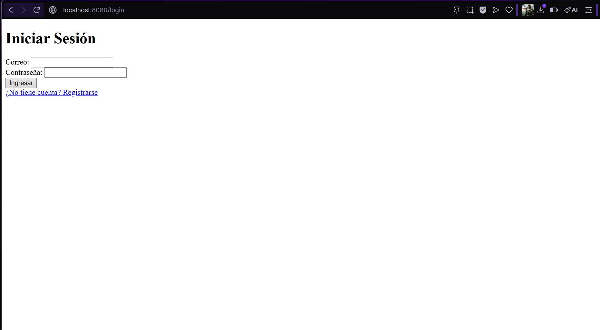
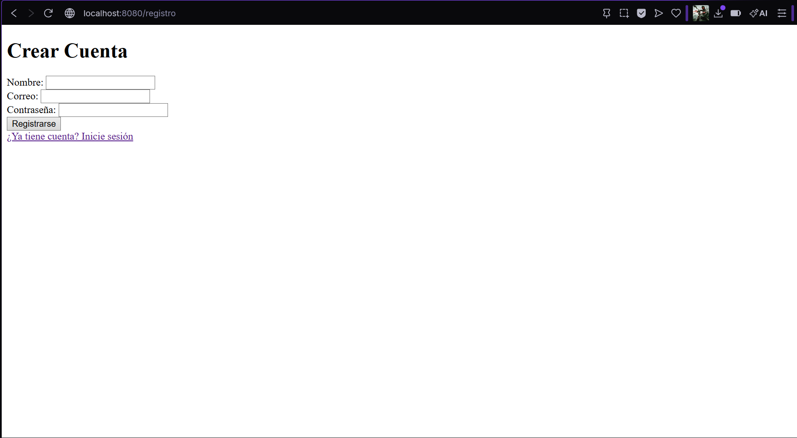
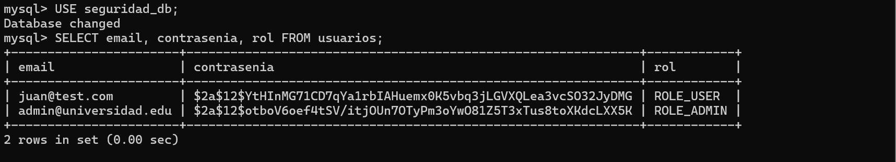
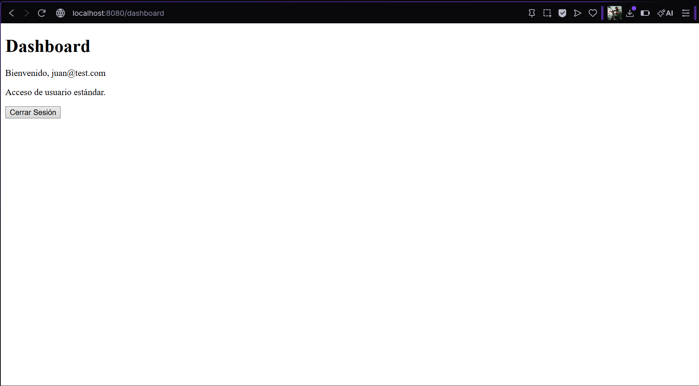
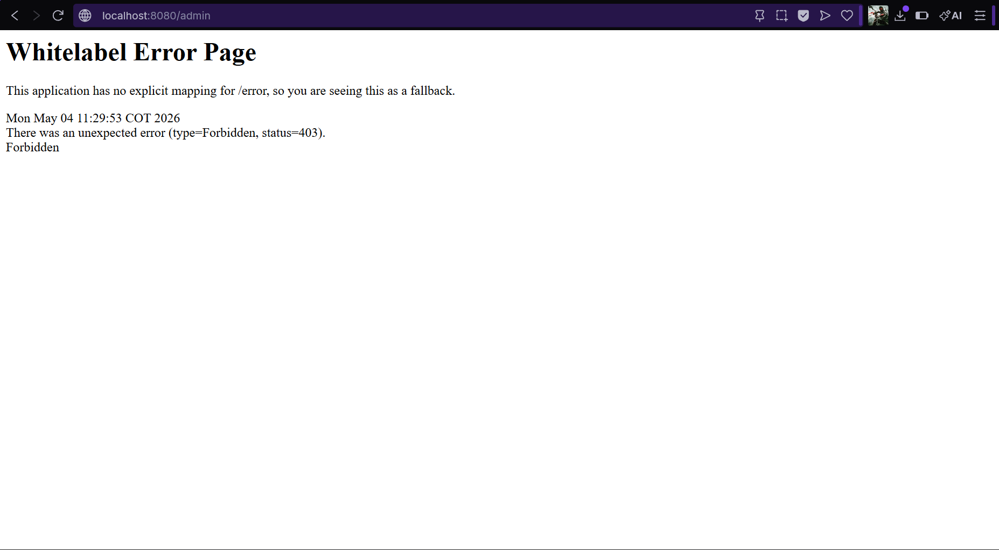
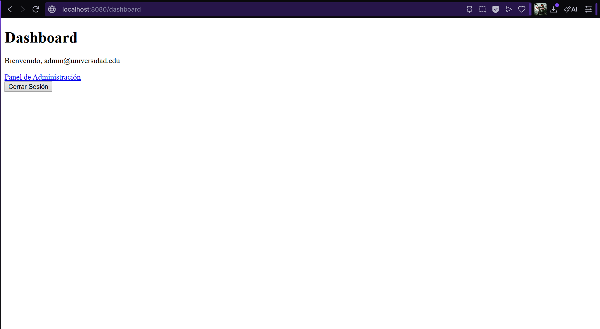
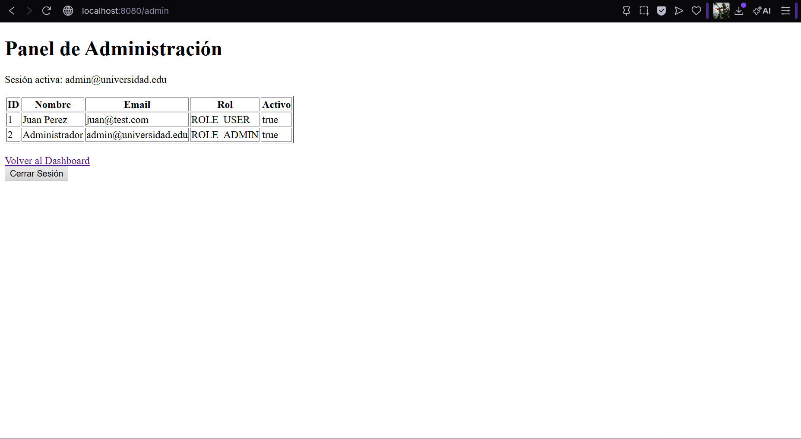

# Seguridad Web — Post-Contenido 1 Unidad 9
**Programación Web | Ingeniería de Sistemas | 2026**

Sistema de autenticación completo implementado con Spring Security 6,
BCryptPasswordEncoder, roles diferenciados ADMIN/USER y base de datos MySQL.

---

## Tecnologías utilizadas
- Java 17
- Spring Boot 3.3.5
- Spring Security 6
- Spring Data JPA + Hibernate
- MySQL 8
- Thymeleaf + thymeleaf-extras-springsecurity6
- BCryptPasswordEncoder (strength 12)
- Maven

---

## Requisitos previos
- Java 17 o superior instalado
- MySQL corriendo en `localhost:3306`
- Maven (o usar el wrapper `./mvnw` incluido)

---

## Configuración de MySQL

La base de datos se crea automáticamente al correr la aplicación
gracias a `createDatabaseIfNotExist=true` en la URL de conexión.

Sin embargo, debes verificar que las credenciales en
`src/main/resources/application.properties` coincidan con tu instalación:

```properties
spring.datasource.url=jdbc:mysql://localhost:3306/seguridad_db?createDatabaseIfNotExist=true&useSSL=false&serverTimezone=UTC
spring.datasource.username=root
spring.datasource.password=TU_PASSWORD
```

### Insertar usuario ADMIN manualmente
Una vez que la app haya corrido por primera vez y Hibernate haya creado
la tabla `usuarios`, ejecutar en MySQL:

```sql
USE seguridad_db;
INSERT INTO usuarios (nombre, email, contrasenia, rol, activo)
VALUES ('Administrador', 'admin@universidad.edu',
'$2a$12$otboV6oef4tSV/itjOUn7OTyPm3oYwO81Z5T3xTus8toXKdcLXX5K',
'ROLE_ADMIN', 1);
```
> La contraseña hasheada corresponde a `admin123` con BCrypt strength 12.

---

## Cómo ejecutar

```bash
# Clonar el repositorio
git clone https://github.com/Abrahan07/ProWeb-Remolina-post1-u9.git

# Entrar al proyecto
cd ProWeb-Remolina-post1-u9

# Ejecutar
./mvnw spring-boot:run
```

Abrir en el navegador: [http://localhost:8080](http://localhost:8080)

---

## Usuarios de prueba

| Nombre | Email | Contraseña | Rol |
|---|---|---|---|
| Juan Pérez | juan@test.com | 123456 | ROLE_USER |
| Administrador | admin@universidad.edu | admin123 | ROLE_ADMIN |

---

## Rutas de la aplicación

| Ruta | Acceso | Descripción |
|---|---|---|
| `/` | Público | Página principal |
| `/registro` | Público | Registro de nuevos usuarios |
| `/login` | Público | Formulario de inicio de sesión |
| `/dashboard` | Autenticado | Panel principal del usuario |
| `/admin` | Solo ADMIN | Panel de administración |
| `/logout` | Autenticado | Cierre de sesión |

---

## Arquitectura del proyecto
```
 src/main/java/com/universidad/seguridad/
├── config/
│   └── SecurityConfig.java         # SecurityFilterChain, BCrypt, AuthProvider
├── controller/
│   └── AuthController.java         # Endpoints: login, registro, dashboard, admin
├── model/
│   └── Usuario.java                # Entidad JPA
├── repository/
│   └── UsuarioRepository.java      # JpaRepository con findByEmail
├── service/
│   ├── UsuarioService.java         # Lógica de registro con BCrypt
│   └── UsuarioDetailsService.java  # Implementa UserDetailsService
└── SeguridadApplication.java

src/main/resources/
├── templates/
│   ├── auth/
│   │   ├── login.html
│   │   └── registro.html
│   ├── admin/
│   │   └── panel.html
│   └── dashboard.html
└── application.properties
 ```

---

## Evidencia de funcionamiento

### Formulario de Login


### Registro de usuario


### Contraseña hasheada con BCrypt en MySQL


### Dashboard usuario USER


### Error 403 — Acceso denegado para USER en /admin


### Dashboard usuario ADMIN


### Panel de Administración


---
